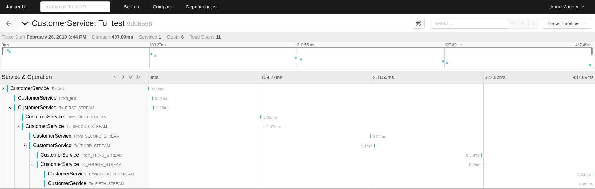

# Apache Kafka Tracing Support for REST Proxy, Connect and KSQL
Interceptors-based approach to implement distributed tracing in Apache Kafka technologies

## Requirements

- Java 8+
- Kafka 2.0.0+

## Overview

The interceptors from the [OpenTracing Apache Kafka Client project](https://github.com/opentracing-contrib/java-kafka-client) are great implementations to use with Java-based applications where you own the code and are able to instantiate your own tracers and make them available throughout the JVM. However, there are situations in which records will be produced and consumed from JVMs that are automatically created for you, and you don't have any way to instantiate your own tracers because its source-code is not available. Or maybe it is, but you are not allowed to change it.

Typical examples include the use of [Schema Registry](https://docs.confluent.io/current/schema-registry/docs/index.html), [REST Proxy](https://docs.confluent.io/current/kafka-rest/docs/index.html), [Kafka Connect](https://docs.confluent.io/current/connect/index.html), and [KSQL Servers](https://docs.confluent.io/current/ksql/docs/index.html). In these technologies, the JVMs are automatically created by pre-defined scripts and you would need a special type of interceptor -- one that can instantiate their own tracers based on configuration specified in an external file. For this particular situation, you can use the Jaeger Tracing support provided by this project.



The example above shows the tracing across different Kafka topics. The first topic called `test` received a record sent by REST Proxy, which in turn had the interceptors installed. Then, the record is consumed by a stream called `FIRST_STREAM` created on KSQL, which also had the interceptors installed. Still in KSQL; multiple other streams (`SECOND_STREAM`, `THIRD_STREAM`, etc) were created to copy data from/to another stream, to test if the tracing can keep up with the flow.

## Usage

For example, if you want to use these interceptors with a KSQL Server, you need to edit the properties configuration file used to start the server and include the following lines:

```java
bootstrap.servers=localhost:9092
listeners=http://localhost:8088
auto.offset.reset=earliest

############################## Jaeger Tracing Configuration ################################

producer.interceptor.classes=io.confluent.devx.util.KafkaTracingProducerInterceptor
consumer.interceptor.classes=io.confluent.devx.util.KafkaTracingConsumerInterceptor

############################################################################################
```

By default, the interceptors will leverage any tracers registered using an [TracerResolver](https://github.com/opentracing-contrib/java-tracerresolver). Using this technique allows the interceptors to be tracer agonostic, and you are free to use any tracer that you are comfortable with.

## Dependencies

These are the dependencies that you will need to install in your classpath along with the interceptors:

```xml
<dependency>
    <groupId>io.opentracing</groupId>
    <artifactId>opentracing-api</artifactId>
    <version>VERSION</version>
</dependency>

<dependency>
    <groupId>io.opentracing</groupId>
    <artifactId>opentracing-util</artifactId>
    <version>VERSION</version>
</dependency>

<dependency>
    <groupId>io.opentracing.contrib</groupId>
    <artifactId>opentracing-kafka-client</artifactId>
    <version>VERSION</version>
</dependency>

<dependency>
   <groupId>io.opentracing.contrib</groupId>
   <artifactId>opentracing-tracerresolver</artifactId>
   <version>VERSION</version>
</dependency>

<dependency>
    <groupId>io.opentracing</groupId>
    <artifactId>opentracing-noop</artifactId>
    <version>VERSION</version>
</dependency>

<dependency>
    <groupId>org.apache.thrift</groupId>
    <artifactId>libthrift</artifactId>
    <version>VERSION</version>
</dependency>

```

## License

[Apache 2.0 License](./LICENSE).